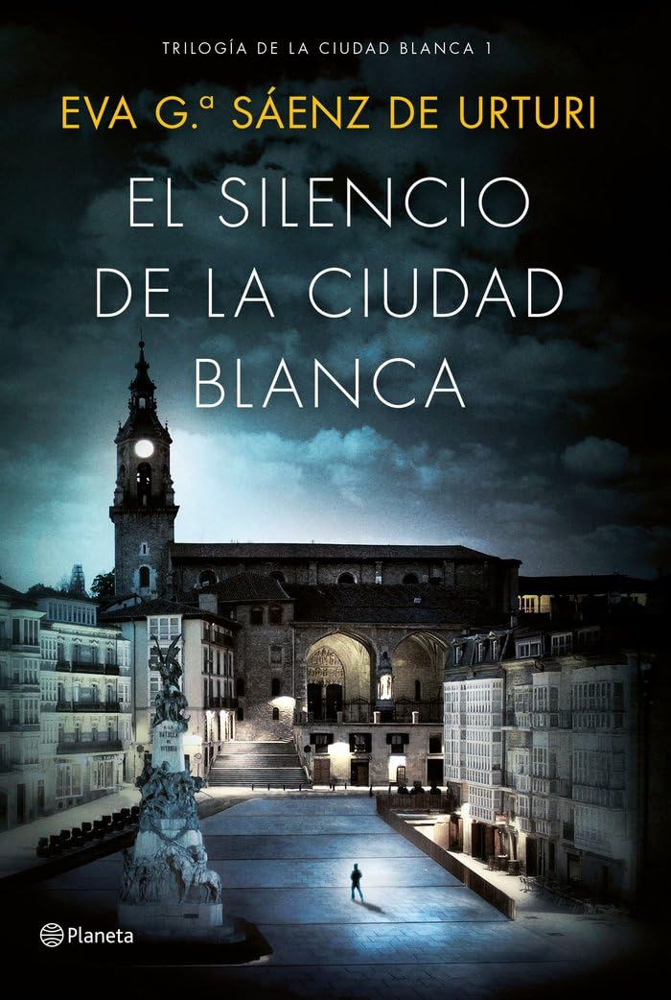

# El silencio de la ciudad blanca [2016]

## Personajes

* [Unai López de Ayala](../familias/lopez.md#unai)
* [Germán López de Ayala](../familias/lopez.md#german)
* [Abuelo López de Ayala](../familias/lopez.md#abuelo)
* [Paula](../README.md#paula)
* [Martina López de Arroyabe](../cuadrilla/README.md#martina)
* [Alba Díaz de Salvatierra](../familias/diaz.md#alba)
* [Estíbaliz Ruiz de Gauna](../familias/ruiz_de_gauna.md#esti)
* [Eneko Ruiz de Gauna (el Hierbas, el Eguzkilore)](../familias/ruiz_de_gauna.md#eneko)
* [Doctora Guevara](../README.md#guevara)
* [Comisario Medina](../README.md#medina)
* [Juez Olano](../README.md#olano)
* [Tasio Ortiz de Zárate](../familias/ortiz.md#tasio)
* [Ignacio Ortiz de Zárate](../familias/ortiz.md#ignacio)
* [Javier Ortiz de Zárate](../familias/ortiz.md#javier)
* [Blanca Díaz de Antoñana](../README.md#blanca_d)
* [Álvaro Urbina](../README.md#alvaro_u)
* [Emilia Aranguren](../README.md#emilia)
* [Mario Santos](../README.md#nancho)
* [Pancorbo](../README.md#pancorbo)
* [Inés Ochoa](../README.md#ines_o)
* [Iker](../README.md#iker)
* [Lutxo](../cuadrilla/README.md#lutxo)
* [Asier](../cuadrilla/README.md#asier)
* [José Javier (Jota)](../cuadrilla/README.md#jota)
* [Xabi](../cuadrilla/README.md#xabi)
* [Nerea](../cuadrilla/README.md#nerea)
* [Enara Fernández de Betoño](../familias/fernandez.md#enara)
* [Antonio Fernández de Betoño](../familias/fernandez.md#antonio)
* [Peio](../README.md#peio)
* [Alejandro Pérez de Arriluca](../victimas/README.md#alejandro_p)
* [Aitana Garmendia](../README.md#aitana_g)
* [Maturana (MatuSalem)](../README.md#maturana)
* [Urresko Neska (Golden Girl)](../familias/pereda.md#lourdes)
* [Felisa](../README.md#felisa)
* [Sergio](../cuadrilla/README.md#sergio)
* [Sara](../README.md#sara)
* [Lydia García de Vicuña](../victimas/README.md#lydia_g)
* [Don Tiburcio de Sáenz de Urturi](../README.md#tiburcio)
* [Mateo Ruiz de Zuazo](../victimas/README.md#mateo_r)
* [Irene Martínez de San Román](../victimas/README.md#irene_m)
* [Antonio Garrido-Stoker](../README.md#antonio_g)
* [Nancho](../README.md#nancho)
* [Venancio Lopidana](../familias/lopidana.md#venencio)
* [Idoia Lopidana](../familias/lopidana.md#idoia)
* [Adoni Lopidana](../familias/lopidana.md#adoni)
* [Regina Muñoz](../familias/lopidana.md#regina)
* [María Jesús Letona (Txusa)](../README.md#txusa)
* [Saioa](../README.md#saioa)

Autor:  [Andreas Steffen][AS] [CC BY 4.0][CC]

[AS]: mailto:andreas.steffen@strongsec.net
[CC]: https://creativecommons.org/licenses/by/4.0/deed.es
