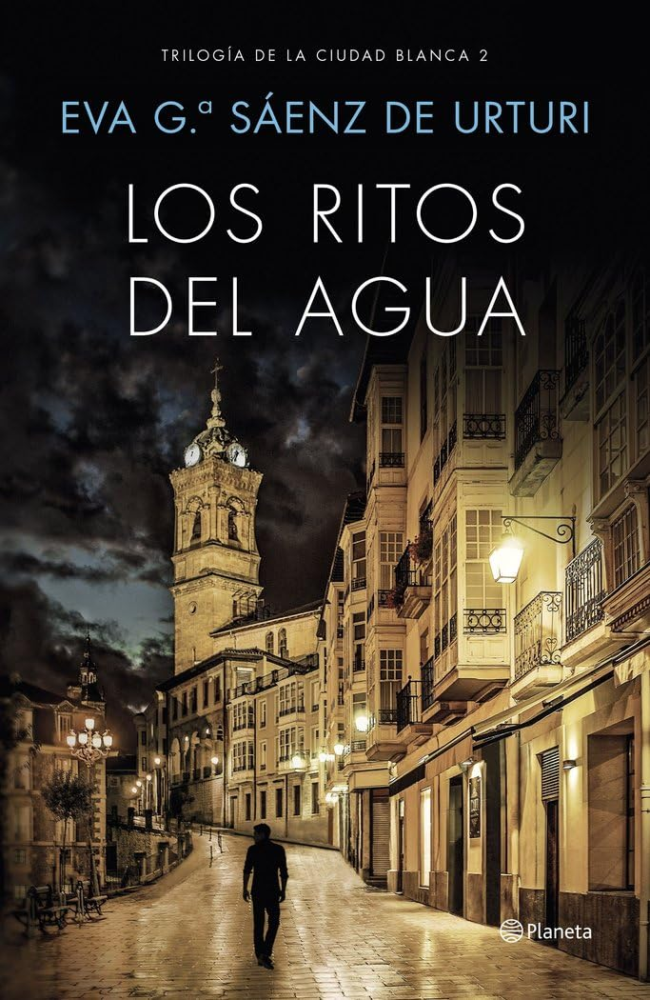

# Los ritos del agua [2017]

## Personajes

* [Unai López de Ayala](../familia_lopez/README.md#unai)
* [Germán López de Ayala](../familia_lopez/README.md#german)
* [Abuelo López de Ayala](../familia_lopez/README.md#abuelo)
* [Alba Díaz de Salvatierra](../familia_diaz/README.md#alba)
* [Deba Díaz de Salvatierra](../familia_diaz/README.md#deba)
* [Estíbaliz Ruiz de Gauna](../familia_ruiz_de_gauna/README.md#esti)
* [Juez Olano](../README.md#olano)
* [Ana Belén Liaño (Annabel Lee)](../README.md#ana_b)
* [Lutxo](../cuadrilla/README.md#lutxo)
* [Asier](../cuadrilla/README.md#asier)
* [José Javier (Jota)](../cuadrilla/README.md#jota)
* [Saúl Tovar](../familia_tovar/README.md#saul)
* [Rebeca Tovar](../familia_tovar/README.md#rebeca)
* [Andoni Cuesta](../README.md#andoni_c)
* [Doctora Guevara](../README.md#guevara)
* [Goyo Muguruza](../README.md#goyo_m)
* [Comisario Medina](../README.md#medina)
* [Tasio Ortiz de Zárate](../familia_ortiz/README.md#tasio)
* [Ignazio Ortiz de Zárate](../familia_ortiz/README.md#ignazio)
* [Diana Aldecoa](../README.md#diana_a)
* [Marian Martínez](../README.md#marian_m)
* [Manu Peña](../README.md#manu_p)
* [Milán Martínez](../README.md#milan_m)
* [Nancho](../README.md#nancho)
* [Blanca Díaz de Antoñana](../README.md#blanca_d)
* [Pablo Lanero (Paulaner)](../README.md#pablo_l)

Autor:  [Andreas Steffen][AS] [CC BY 4.0][CC]

[AS]: mailto:andreas.steffen@strongsec.net
[CC]: https://creativecommons.org/licenses/by/4.0/deed.es
