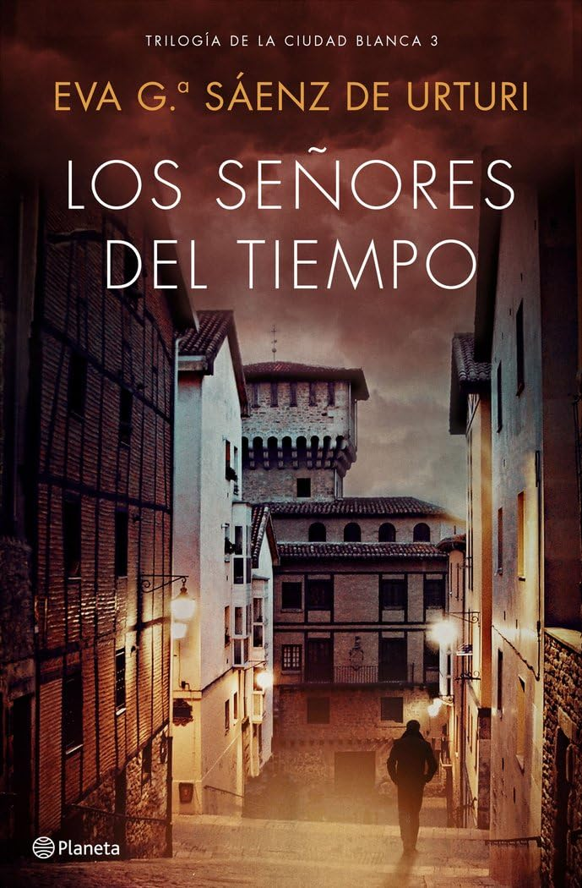

# Los señores del tiempo [2018]

## Personajes

### El presente

* [Unai López de Ayala](../familias/lopez.md#unai)
* [Germán López de Ayala](../familias/lopez.md#german)
* [Abuelo López de Ayala](../familias/lopez.md#abuelo)
* [Alba Díaz de Salvatierra](../familias/diaz.md#alba)
* [Deba Díaz de Salvatierra](../familias/diaz.md#deba)
* [Nieves Díaz de Salvatierra](../familias/diaz.md#nieves)
* [Estíbaliz Ruiz de Gauna](../familias/ruiz_de_gauna.md#esti)
* [Comisario Medina](../README.md#medina)
* [Doctora Guevara](../README.md#guevara)
* [Goyo Muguruza](../README.md#goyo_m)
* [Manu Peña](../README.md#manu_p)
* [Milán Martínez](../familias/martinez.md#milan)
* [Andrés Madariaga](../README.md#andres_m)
* [Diego Veilaz](../familias/nograro.md#ramiro)
* [Antón Lasaga](../familias/lasaga.md#anton)
* [Andoni Lasaga](../familias/lasaga.md#andoni)
* [Irene Lasaga](../familias/lasaga.md#irene)
* [Carlos](../README.md#carlos)
* [Estefanía Nájera](../familias/najera.md#estefania)
* [Oihana Nájera](../familias/najera.md#oihana)
* [Tasio Ortiz de Zárate](../familias/ortiz.md#tasio)
* [Ignazio Ortiz de Zárate](../familias/ortiz.md#ignazio)
* [Golden Girl](../familias/pereda.md#lourdes)
* [Maturana (MatuSalem)](../README.md#maturana)
* [Pruden Malatrama](../README.md#pruden_m)
* [Ramiro Alvar Nograro](../familias/nograro.md#ramiro)
* [Alvar Nograro](../familias/nograro.md#alvaro)
* [Lorenzo Alvar Nograro](../familias/nograro.md#lorenzo)
* [Inés](../familias/nograro.md#ines)
* [Claudia Mújica](../README.md#claudia)
* [Fausti Mesanza](../README.md#fausti_m)
* [Saúl Tovar](../familias/tovar.md#saul)
* [Héctor del Castillo](../familias/del_castillo.md#hector)
* [Iago del Castillo](../familias/del_castillo.md#iago)
* [Gemma](../README.md#gemma)
* [Gonzales Martínez](../README.md#gonzales_m)

### [El siglo XII](../siglo_xii/README.md)

* [Diago Vela](../siglo_xii/familias/vela.md#diago)
* [Nagorno Vela](../siglo_xii/familias/vela.md#nagorno)
* [Lyra Vela](../siglo_xii/familias/vela.md#lyra)
* [Onneca de Maestu](../siglo_xii/familias/maestu.md#onneca)
* [Furtado de Maestu](../siglo_xii/familias/maestu.md#furtado)
* [Gunnar Kolbrunson](../siglo_xii/README.md#gunnar_k)
* [Alix de Salcedo](../siglo_xii/README.md#alix)
* [Abuela Lucía](../siglo_xii/README.md#lucia)
* [Sancho el Sabio](../siglo_xii/README.md#sancho)
* [García de Pamplona](../siglo_xii/README.md#garcia)
* [Héctor Dicastillo](../siglo_xii/README.md#hector)
* [Astonga](../siglo_xii/README.md#astonga)
* [Lope](../siglo_xii/README.md#lope)
* [Ruy de Maturana](../siglo_xii/familias/maturana.md#ruy)
* [Ruiz de Maturana](../siglo_xii/familias/maturana.md#ruiz)
* [Pérez de Oñate](../siglo_xii/README.md#perez_o)

Autor:  [Andreas Steffen][AS] [CC BY 4.0][CC]

[AS]: mailto:andreas.steffen@strongsec.net
[CC]: https://creativecommons.org/licenses/by/4.0/deed.es
