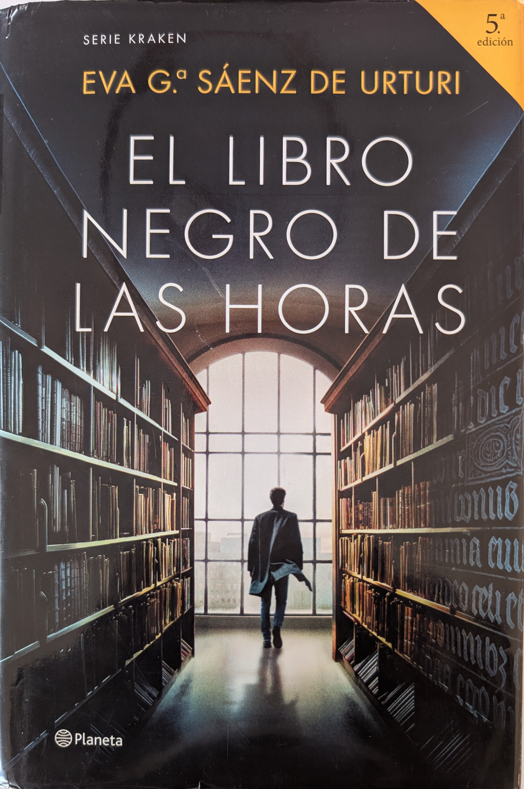

# El libro negro de las horas [2022]

!

## Personajes

* [Unai López de Ayala](../README.md#unai_l)
* [Germán López de Ayala](../README.md#german_l)
* [Abuelo López de Ayala](../README.md#abuelo_l)
* [Gael López de Ayala](../README.md#gael_l)
* [Ítaca Expósito](../README.md#itaca_e)
* [Mencía Madariaga](../README.md#mencia_m)
* [Marta Gómez](../README.md#marta_g)
* [Alba Díaz de Salvatierra](../README.md#alba_d)
* [Deba Díaz de Salvatierra](../README.md#deba_d)
* [Estíbaliz Ruiz de Gauna](../README.md#esti_r)
* [Lutxo](../README.md#lutxo)
* [Edmundo](../README.md#edmundo)
* [Mikaela (Goya)](../README.md#mikaela)
* [Telmo](../README.md#telmo)
* [Lorea Díaz de Durana](../README.md#lorea_d)
* [Sarah Morgan](../README.md#sarah_m)
* [Alistair Morgan](../README.md#alistair_m)
* [Gael Morgan](../README.md#gael_m)
* [Benedict Callaghan](../README.md#benedict_c)
* [Alicia Lasarte](../README.md#alicia_l)
* [Gaspar Abad](../README.md#gaspar_a)
* [Fabio](../README.md#fabio)
* [Justino](../README.md#justino)
* [Pedro Bardel](../README.md#pedro_b)
* [Casto Olivier](../README.md#casto_o)
* [Diego Olivier](../README.md#diego_o)
* [Carmen Olivier](../README.md#carmen_o)
* [Calibán](../README.md#caliban)
* [Madre Magadalena](../README.md#magdalena)
* [Padre Lazaro](../README.md#lazaro)
* [Don José María](../README.md#jose_maria)
* [Jimena Garay (Hermana Aquilina)](../README.md#jimena_g)
* [Mateo Garay](../README.md#mateo_g)

Autor:  [Andreas Steffen][AS] [CC BY 4.0][CC]

[AS]: mailto:andreas.steffen@strongsec.net
[CC]: https://creativecommons.org/licenses/by/4.0/deed.es
