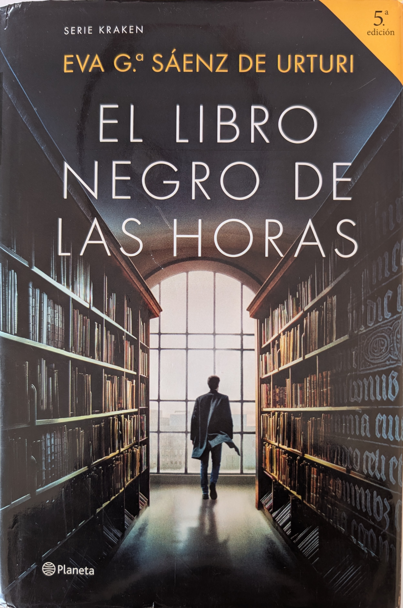

# El libro negro de las horas [2022]

!

## Personajes

* [Unai López de Ayala](../familias/lopez.md#unai)
* [Germán López de Ayala](../familias/lopez.md#german)
* [Abuelo López de Ayala](../familias/lopez.md#abuelo)
* [Gael López de Ayala](../familias/lopez.md#gael)
* [Ítaca Expósito](../egerias/README.md#itaca)
* [Mencía Madariaga](../README.md#mencia_m)
* [Marta Gómez](../README.md#marta_g)
* [Alba Díaz de Salvatierra](../familias/diaz.md#alba)
* [Deba Díaz de Salvatierra](../familias/diaz.md#deba)
* [Estíbaliz Ruiz de Gauna](../familias/ruiz_de_gauna.md#esti)
* [Lutxo](../cuadrilla/README.md#lutxo)
* [Edmundo](../README.md#edmundo)
* [Mikaela (Goya)](../README.md#mikaela)
* [Telmo](../README.md#telmo)
* [Lorea Díaz de Durana](../README.md#lorea_d)
* [Sarah Morgan](../familias/morgan.md#sarah)
* [Alistair Morgan](../familias/morgan.md#alistair)
* [Gael Morgan](../familias/morgan.md#gael)
* [Benedict Callaghan](../README.md#benedict_c)
* [Alicia Lasarte](../README.md#alicia_l)
* [Gaspar Abad](../README.md#gaspar_a)
* [Fabio](../README.md#fabio)
* [Justino](../README.md#justino)
* [Pedro Bardel](../README.md#pedro_b)
* [Casto Olivier](../familias/olivier.md#casto)
* [Diego Olivier](../familias/olivier.md#diego)
* [Carmen Olivier](../familias/olivier.md#carmen)
* [Calibán](../familias/olivier.md#caliban)
* [Madre Magadalena](../README.md#magdalena)
* [Padre Lazaro](../README.md#lazaro)
* [Don José María](../README.md#jose_maria)
* [Jimena Garay (Hermana Aquilina)](../familias/garay.md#jimena)
* [Mateo Garay](../familias/garay.md#mateo)

Autor:  [Andreas Steffen][AS] [CC BY 4.0][CC]

[AS]: mailto:andreas.steffen@strongsec.net
[CC]: https://creativecommons.org/licenses/by/4.0/deed.es
