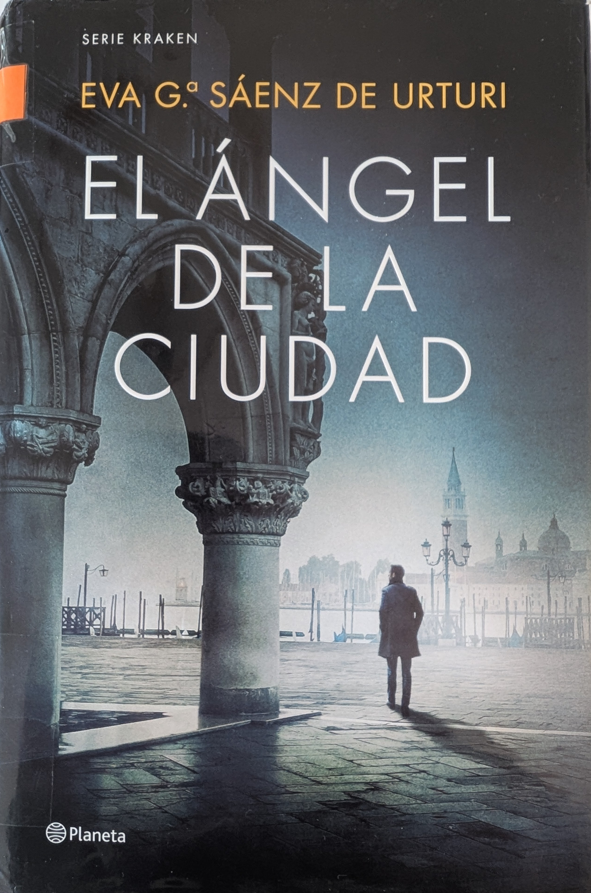

# El ángel de la ciudad [2023]

## Personajes

* [Unai López de Ayala](../README.md#unai_l)
* [Germán López de Ayala](../README.md#german_l)
* [Abuelo López de Ayala](../README.md#abuelo_l)
* [Gael López de Ayala](../README.md#gael_l)
* [Ítaca Expósito](../README.md#itaca_e)
* [Mencía Madariaga](../README.md#mencia_m)
* [Alba Díaz de Salvatierra](../README.md#alba_d)
* [Deba Díaz de Salvatierra](../README.md#deba_d)
* [Estíbaliz Ruiz de Gauna](../README.md#esti_r)
* [Alistair Morgan](../README.md#alistair_m)
* [Benedict Callaghan](../README.md#benedict_c)
* [Alicia Lasarte](../README.md#alicia_l)
* [Gaspar Abad](../README.md#gaspar_a)
* [Pietra Da Riva](../README.md#pietra_r)
* [Leone Da Riva](../README.md#leone_r)
* [Renzo Scarpa](../README.md#renzo_s)
* [Silvano Scarpa](../README.md#silvano_s)
* [Nicola](../README.md#nicola)
* [Filippo](../README.md#filippo)

Autor:  [Andreas Steffen][AS] [CC BY 4.0][CC]

[AS]: mailto:andreas.steffen@strongsec.net
[CC]: https://creativecommons.org/licenses/by/4.0/deed.es
