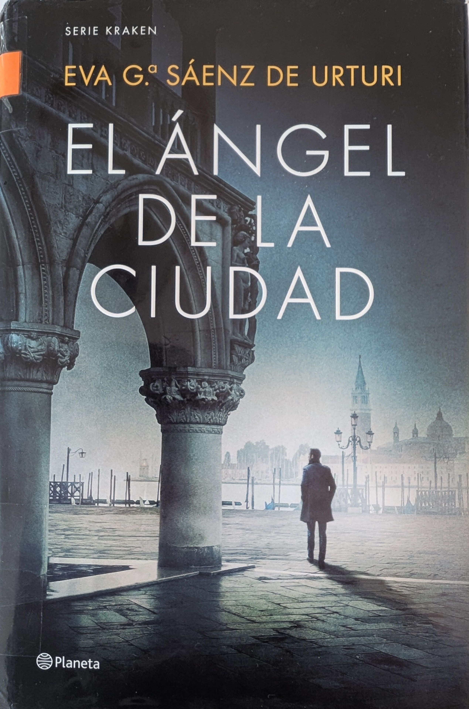

# El ángel de la ciudad [2023]

## Personajes

* [Unai López de Ayala](../familias/lopez.md#unai)
* [Germán López de Ayala](../familias/lopez.md#german)
* [Abuelo López de Ayala](../familias/lopez.md#abuelo)
* [Gael López de Ayala](../familias/lopez.md#gael)
* [Ítaca Expósito](../egerias/README.md#itaca)
* [Mencía Madariaga](../README.md#mencia_m)
* [Alba Díaz de Salvatierra](../familias/diaz.md#alba)
* [Deba Díaz de Salvatierra](../familias/diaz.md#deba)
* [Estíbaliz Ruiz de Gauna](../familias/ruiz_de_gauna.md#esti)
* [Calibán](../familias/olivier.md#caliban)
* [Alistair Morgan](../familias/morgan.md#alistair)
* [Benedict Callaghan](../README.md#benedict_c)
* [Alicia Lasarte](../README.md#alicia_l)
* [Gaspar Abad](../README.md#gaspar_a)
* [Pietra Da Riva](../familias/da_riva.md#pietra)
* [Leone Da Riva](../familias/da_riva.md#leone)
* [Renzo Scarpa](../familias/scarpa.md#renzo)
* [Silvano Scarpa](../familias/scarpa.md#silvano)
* [Nicola](../README.md#nicola)
* [Gennaro](../README.md#gennaro)
* [Filippo](../README.md#filippo)
* [Charlotte](../egerias/README.md#charlotte)
* [Ava](../egerias/README.md#ava)
* [Madison](../egerias/README.md#madison)
* [Kora](../egerias/README.md#kora)
* [Harper](../egerias/README.md#haroer)
* [Chiara Corner](../README.md#chiara_c)
* [Goya](../README.md#mikaela)
* [Ricardo Ruiz de Azúa](../familias/ruiz_de_azua.md#ricardo_)
* [Ricardo Ruiz de Azúa hijo](../familias/ruiz_de_azua.md#ricardo_hijo)
* [Merkel Ruiz de Azúa](../familias/ruiz_de_azua.md#merkel)
* [Asun](../familias/ruiz_de_azua.md#asun)
* [José María Aldecoa](../README.md#aldecoa)
* [Olmedo](../README.md#olmedo)

Autor:  [Andreas Steffen][AS] [CC BY 4.0][CC]

[AS]: mailto:andreas.steffen@strongsec.net
[CC]: https://creativecommons.org/licenses/by/4.0/deed.es
